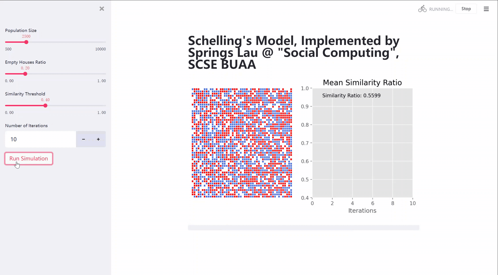

## "Social Computing" HW4 by Springs Lau @ BUAA

# Implementation of Schelling Model Using Python and Streamlit

<div style="display:block;margin:auto;height:80%;width:80%">
  
</div>

# Dependencies

- Made with ```Python 3.9``` , to work with `Python 3.*`
- You'll need the following libraries: ```Numpy```, ```Matplotlib``` and `Streamlit`
- All the requirements have been specified in `requirements.txt`

# Running

Take `Windows 10` for example, run the following in your `Terminal`

```bash
streamlit run .\app.py
```

# More...

Feel free to report issues to my **GitHub**@SprLau, the program is on this [*site*](https://github.com/SprLau/schelling-model-implementation).